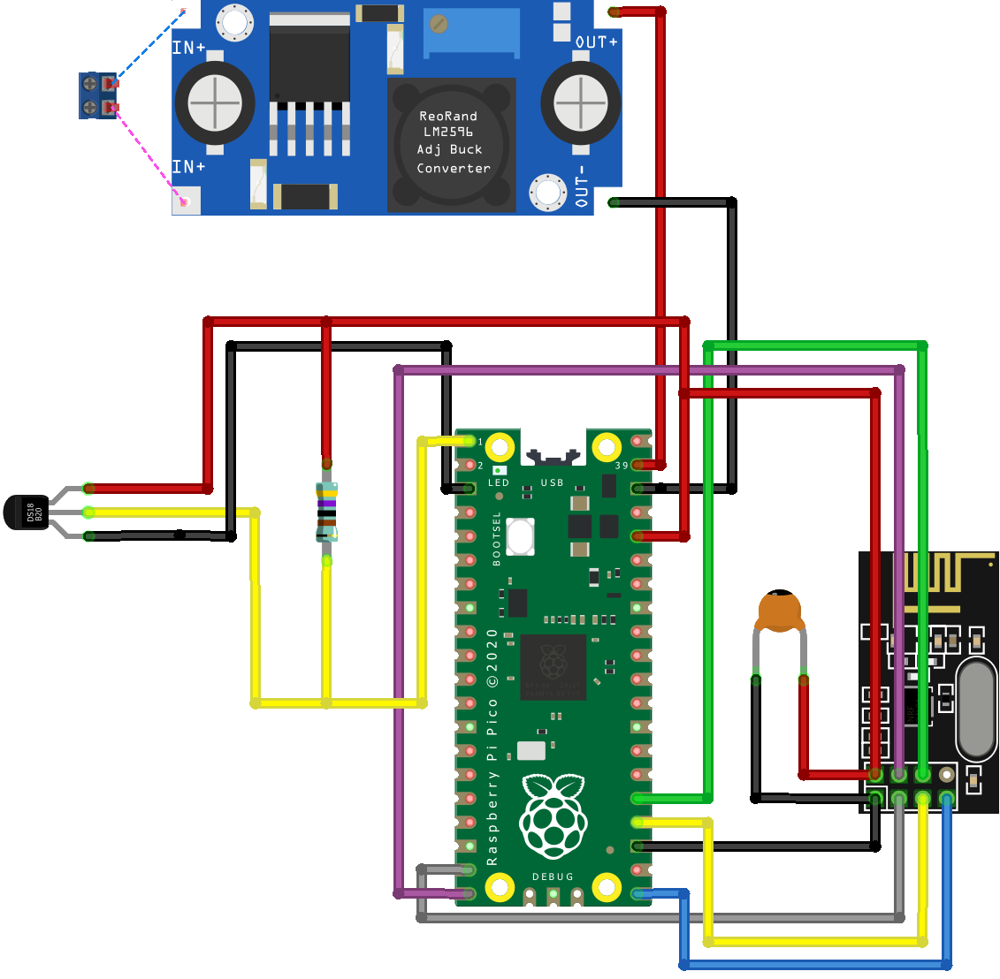
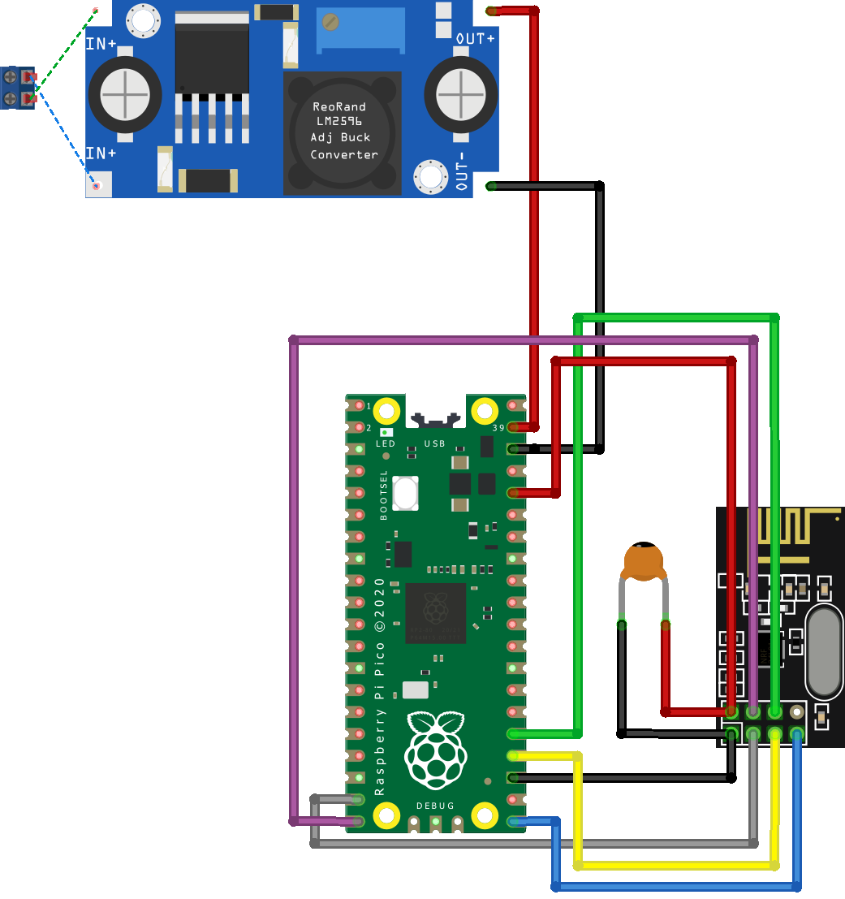

# Pico projects

## Remote temperature measurement

Measure temperature on a remote location. The measurement is sent with an nrf24l01 transceiver to a server.

Parts:
- pico
- nrf24l01+
- DS18B20

~1.17mA @ SM_SLEEP

See the [code](src/temperature/main.cpp).

## Relay

An intermediate relay node can be used to cover more distance.

Parts:
- pico
- nrf24l01+

See the [code](src/relay/main.cpp).

